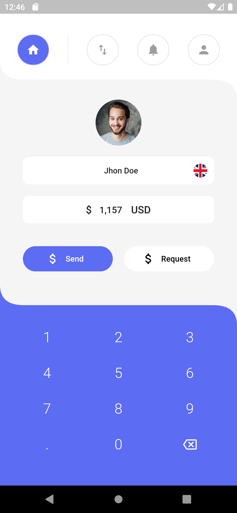

# Money Transfer

Simple app for money transfer

## Getting Started

This project is a starting point for a Flutter application.

A few resources to get you started if this is your first Flutter project:

- [Lab: Write your first Flutter app](https://flutter.dev/docs/get-started/codelab)
- [Cookbook: Useful Flutter samples](https://flutter.dev/docs/cookbook)

For help getting started with Flutter, view our
[online documentation](https://flutter.dev/docs), which offers tutorials,
samples, guidance on mobile development, and a full API reference.

## Screenshots

## Thanks to

[Yogesh Solanki](https://www.uplabs.com/posts/money-transfer-ui-95b0ba0e-7aa3-4882-a294-9b9f7d5f67fa) for the design <3